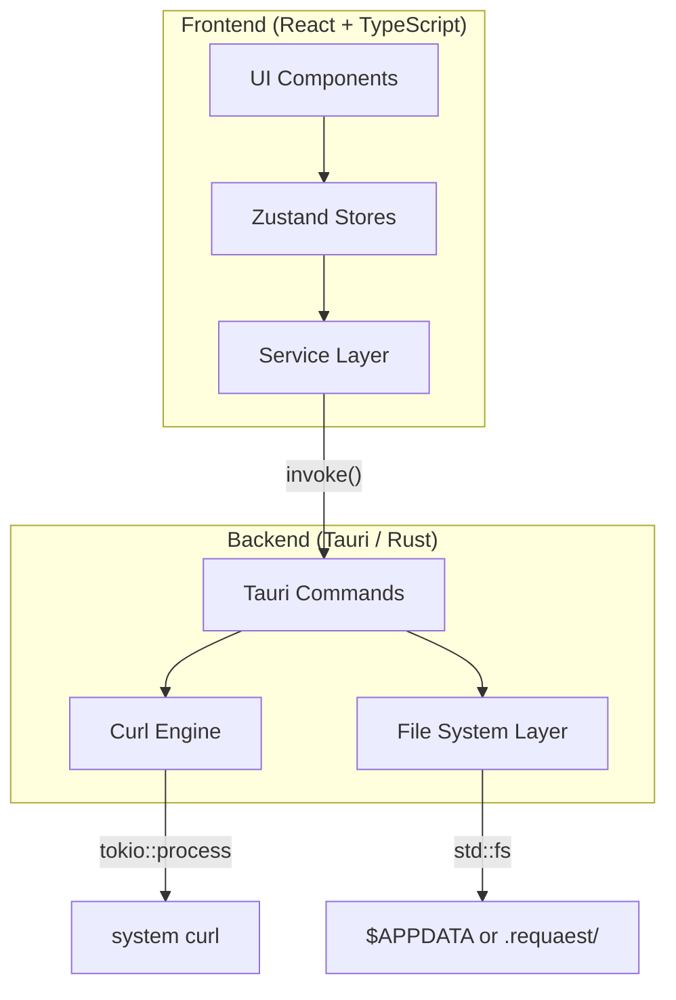
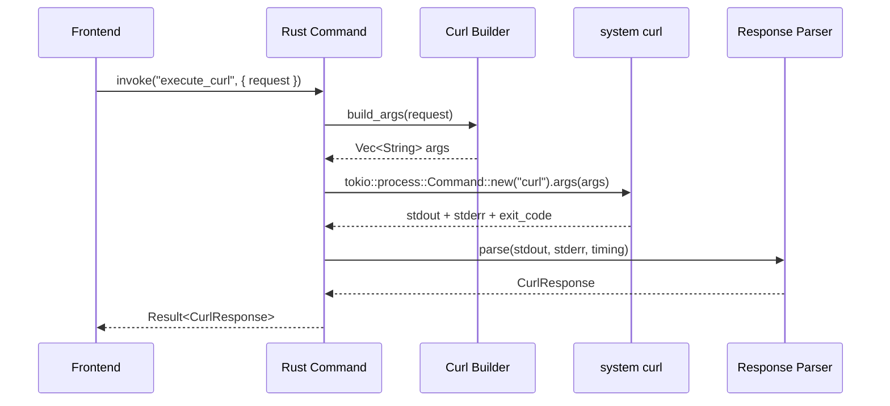

# reQuaest — Technical Blueprint

A simplified Postman clone: a curl wrapper with environment variables and post-request scripting, delivered as a single clickable desktop application.

---

## Tech Stack Decision

| Layer | Technology | Rationale |
|-------|-----------|-----------|
| **Desktop shell** | **Tauri v2** | Single distributable binary, embeds WebView2, ~5 MB footprint vs Electron's ~150 MB. Native Rust backend for process & FS access. |
| **Frontend** | **React 18 + TypeScript** | Component model maps naturally to the tabbed request builder UI. TypeScript catches data‐model mismatches at compile time. |
| **Build tooling** | **Vite** | Sub-second HMR, first-class Tauri integration, TypeScript out of the box. |
| **Code editor** | **CodeMirror 6** | Lightweight (~50 KB gzip), modular, purpose-built for embedding. Used for body editors and post-request script editor. |
| **Curl execution** | **System curl** via `tokio::process::Command` | Uses the curl binary that ships with Windows 10/11 (`C:\Windows\System32\curl.exe`). Spawned directly from Rust — no Tauri shell plugin, no sidecar bundling. |
| **Scripting sandbox** | **`quickjs-emscripten`** | WASM-compiled QuickJS engine. True sandbox — no access to DOM, FS, or network. Safe for user scripts. |
| **State management** | **Zustand** | Minimal boilerplate, TypeScript-native, works well with React's concurrent features. |
| **Styling** | **Vanilla CSS** with CSS custom properties | Full control, no build-time CSS framework overhead. Design tokens via `--var()`. |
| **Target platform** | **Windows** (v1) | Single-platform focus. macOS/Linux deferred to future versions. |

> [!NOTE]
> **Why system curl?** Windows 10 (build 17063+) and Windows 11 ship with curl at `C:\Windows\System32\curl.exe`. Using the system binary means: (1) zero bundling complexity, (2) smaller installer, (3) users automatically get curl security patches via Windows Update. The app validates curl availability on startup and shows a clear error if missing.

---

## Architecture Overview



### Clean Architecture Layers

The architecture separates concerns into **four layers** with strict dependency rules — each layer only depends on the layer below it:

```
┌─────────────────────────────────────────────┐
│  UI Layer (React components, CSS)           │  ← Renders state, captures user intent
├─────────────────────────────────────────────┤
│  Store Layer (Zustand stores)               │  ← Application state, UI logic
├─────────────────────────────────────────────┤
│  Service Layer (TypeScript modules)         │  ← Business logic, orchestration
├─────────────────────────────────────────────┤
│  Backend Layer (Tauri commands in Rust)     │  ← I/O: curl execution, file system
└─────────────────────────────────────────────┘
```

> [!NOTE]
> **Why run curl from Rust instead of the frontend?** By routing all curl execution through Rust Tauri commands (using `tokio::process::Command` directly), we get: (1) structured argument validation before execution, (2) response parsing and timing in native code, (3) a single chokepoint for logging/auditing, (4) no need for the `tauri-plugin-shell` — fewer moving parts, and (5) future extensibility (e.g., retry logic, certificate pinning) without touching the UI.

---

## Project Structure

```
reQuaest/
├── src/                                # Frontend source
│   ├── main.tsx                        # React entry point
│   ├── App.tsx                         # Root component, layout shell
│   ├── index.css                       # Global styles & design tokens
│   │
│   ├── components/                     # UI components
│   │   ├── layout/
│   │   │   ├── AppShell.tsx            # Top-level layout (sidebar + main)
│   │   │   ├── TitleBar.tsx            # Custom title bar (env selector, theme toggle)
│   │   │   └── Sidebar.tsx             # Collections tree + history
│   │   ├── request/
│   │   │   ├── RequestTabs.tsx         # Tab bar for open requests
│   │   │   ├── RequestBuilder.tsx      # Method + URL + Send button
│   │   │   ├── ParamsEditor.tsx        # Query params key-value editor
│   │   │   ├── HeadersEditor.tsx       # Headers key-value editor
│   │   │   ├── BodyEditor.tsx          # Body tabs (none/raw/form-data/urlencoded)
│   │   │   ├── AuthEditor.tsx          # Auth helper (None/Bearer/Basic)
│   │   │   └── ScriptEditor.tsx        # Post-request script (CodeMirror)
│   │   ├── response/
│   │   │   ├── ResponsePanel.tsx       # Status bar + tabs container
│   │   │   ├── ResponseBody.tsx        # Pretty/Raw/Preview tabs
│   │   │   ├── ResponseHeaders.tsx     # Collapsible headers table
│   │   │   └── ScriptConsole.tsx       # Console output from scripts
│   │   ├── environment/
│   │   │   ├── EnvSelector.tsx         # Dropdown in title bar
│   │   │   └── EnvManager.tsx          # Modal: CRUD environments & variables
│   │   ├── collection/
│   │   │   ├── CollectionTree.tsx      # Recursive tree view
│   │   │   ├── FolderNode.tsx          # Folder in tree
│   │   │   └── RequestNode.tsx         # Request leaf in tree
│   │   ├── history/
│   │   │   └── HistoryList.tsx         # Searchable history panel
│   │   ├── import/
│   │   │   └── ImportDialog.tsx        # Import from Postman/Insomnia
│   │   └── shared/
│   │       ├── KeyValueEditor.tsx      # Reusable key-value pair editor
│   │       ├── MethodBadge.tsx         # Color-coded HTTP method badge
│   │       └── Modal.tsx              # Generic modal component
│   │
│   ├── stores/                         # Zustand state stores
│   │   ├── requestStore.ts             # Open tabs, active request state
│   │   ├── environmentStore.ts         # Environments, active env, variable resolution
│   │   ├── collectionStore.ts          # Collections tree structure
│   │   ├── historyStore.ts             # Request history
│   │   ├── responseStore.ts            # Response data per tab
│   │   └── uiStore.ts                  # Theme, sidebar state, modals
│   │
│   ├── services/                       # Business logic (no UI, no state)
│   │   ├── curlService.ts              # Build curl args, invoke Rust, parse response
│   │   ├── environmentService.ts       # Variable interpolation engine
│   │   ├── scriptService.ts            # Sandbox runner (quickjs-emscripten)
│   │   ├── collectionService.ts        # CRUD operations on collections
│   │   ├── historyService.ts           # History management
│   │   ├── importService.ts            # Postman/Insomnia import parsers
│   │   └── storageService.ts           # Generic load/save via Tauri commands
│   │
│   ├── types/                          # TypeScript type definitions
│   │   ├── request.ts                  # Request, Header, Param, Body, Auth
│   │   ├── response.ts                 # Response, ResponseHeader
│   │   ├── environment.ts              # Environment, Variable
│   │   ├── collection.ts               # Collection, Folder, CollectionRequest
│   │   ├── history.ts                  # HistoryEntry
│   │   └── script.ts                   # ScriptContext, ScriptResult
│   │
│   └── utils/                          # Pure utility functions
│       ├── curlParser.ts               # Parse a curl command string → Request
│       ├── variableInterpolation.ts    # {{var}} replacement engine
│       ├── formatters.ts               # JSON/XML pretty-print, byte formatting
│       └── shortcuts.ts               # Keyboard shortcut registry
│
├── index.html                          # Vite HTML entry
├── package.json
├── tsconfig.json
├── vite.config.ts
│
└── src-tauri/                          # Rust backend
    ├── src/
    │   ├── main.rs                     # Entry point
    │   ├── lib.rs                      # Tauri builder, plugin & command registration
    │   ├── commands/
    │   │   ├── mod.rs
    │   │   ├── curl.rs                 # execute_curl command
    │   │   ├── fs.rs                   # load_file, save_file, list_dir, ensure_dir
    │   │   └── workspace.rs            # get_workspace_path, switch_workspace, open_workspace
    │   ├── models/
    │   │   ├── mod.rs
    │   │   ├── curl_request.rs         # CurlRequest struct
    │   │   └── curl_response.rs        # CurlResponse struct
    │   └── engine/
    │       ├── mod.rs
    │       ├── curl_builder.rs         # Build curl CLI args from CurlRequest
    │       └── response_parser.rs      # Parse curl output → CurlResponse
    ├── capabilities/
    │   └── default.json                # Security permissions
    ├── icons/                          # App icons
    ├── tauri.conf.json
    ├── Cargo.toml
    └── build.rs
```

---

## Data Models

### Request

```typescript
interface RequestTab {
  id: string;                    // UUID
  name: string;                  // Display name (editable)
  method: HttpMethod;
  url: string;                   // Raw, may contain {{variables}}
  headers: KeyValuePair[];
  params: KeyValuePair[];
  body: RequestBody;
  auth: AuthConfig;
  script: string;               // Post-request JavaScript
  followRedirects: boolean;     // Default: true
  collectionId?: string;        // If saved to a collection
  folderId?: string;            // If inside a folder
  isDirty: boolean;             // Unsaved changes indicator
}

type HttpMethod = 'GET' | 'POST' | 'PUT' | 'PATCH' | 'DELETE' | 'HEAD' | 'OPTIONS' | 'QUERY';

interface KeyValuePair {
  id: string;
  key: string;
  value: string;
  enabled: boolean;             // Toggle individual pairs on/off
}

interface RequestBody {
  type: 'none' | 'raw' | 'form-data' | 'x-www-form-urlencoded';
  raw?: { content: string; format: 'json' | 'xml' | 'text' };
  formData?: KeyValuePair[];
  urlencoded?: KeyValuePair[];
}

interface AuthConfig {
  type: 'none' | 'bearer' | 'basic';
  bearer?: { token: string };
  basic?: { username: string; password: string };
}
```

### Response

```typescript
interface RequestResponse {
  status: number;
  statusText: string;
  headers: KeyValuePair[];
  body: string;
  time: number;                 // Duration in ms
  size: number;                 // Body size in bytes
}
```

### Environment

```typescript
interface Environment {
  name: string;                 // e.g., "dev", "staging", "globals"
  variables: Record<string, string>;
}
```

### Collection

```typescript
interface Collection {
  id: string;
  name: string;
  variables: Record<string, string>;    // Collection-level variables
  items: CollectionItem[];               // Top-level items (folders + requests)
}

type CollectionItem = CollectionFolder | CollectionRequest;

interface CollectionFolder {
  type: 'folder';
  id: string;
  name: string;
  items: CollectionItem[];               // Recursive nesting
}

interface CollectionRequest {
  type: 'request';
  id: string;
  name: string;
  method: HttpMethod;
  url: string;
  headers: KeyValuePair[];
  params: KeyValuePair[];
  body: RequestBody;
  auth: AuthConfig;
  script: string;
  followRedirects: boolean;
}
```

### History

```typescript
interface HistoryEntry {
  id: string;
  timestamp: number;            // Unix ms
  method: HttpMethod;
  url: string;                  // Interpolated URL (resolved variables)
  status: number;
  time: number;
  request: CollectionRequest;   // Full snapshot for re-loading
}
```

---

## Rust Backend — Key Commands

```rust
// ── src-tauri/src/commands/curl.rs ──

/// Receives a structured request, builds curl args, spawns system curl
/// via tokio::process::Command, parses the output, returns a structured response.
#[tauri::command]
async fn execute_curl(
    request: CurlRequest,        // Deserialized from frontend JSON
) -> Result<CurlResponse, AppError> {
    let args = curl_builder::build_args(&request);
    let output = tokio::process::Command::new("curl")
        .args(&args)
        .output()
        .await
        .map_err(|e| AppError::CurlNotFound(e.to_string()))?;
    response_parser::parse(output)
}

/// Checks if curl is available on the system PATH.
#[tauri::command]
async fn check_curl() -> Result<String, AppError> {
    let output = tokio::process::Command::new("curl")
        .arg("--version")
        .output()
        .await
        .map_err(|_| AppError::CurlNotFound(
            "curl not found. Please ensure curl is installed.".into()
        ))?;
    Ok(String::from_utf8_lossy(&output.stdout).to_string())
}


// ── src-tauri/src/commands/fs.rs ──

/// Read a JSON file from the active workspace data directory.
#[tauri::command]
async fn load_file(
    state: State<'_, WorkspaceState>,
    relative_path: String,       // e.g., "environments/dev.json"
) -> Result<String, AppError> { ... }

/// Write a JSON string to the active workspace data directory.
#[tauri::command]
async fn save_file(
    state: State<'_, WorkspaceState>,
    relative_path: String,
    content: String,
) -> Result<(), AppError> { ... }

/// Delete a file from the active workspace data directory.
#[tauri::command]
async fn delete_file(
    state: State<'_, WorkspaceState>,
    relative_path: String,
) -> Result<(), AppError> { ... }

/// List files in a subdirectory of the active workspace.
#[tauri::command]
async fn list_directory(
    state: State<'_, WorkspaceState>,
    relative_path: String,       // e.g., "environments"
) -> Result<Vec<String>, AppError> { ... }

/// Ensure a directory exists (recursive mkdir).
#[tauri::command]
async fn ensure_directory(
    state: State<'_, WorkspaceState>,
    relative_path: String,
) -> Result<(), AppError> { ... }


// ── src-tauri/src/commands/workspace.rs ──

/// Returns the current workspace root path.
#[tauri::command]
async fn get_workspace_info(
    state: State<'_, WorkspaceState>,
) -> Result<WorkspaceInfo, AppError> { ... }

/// Switches to a local .requaest/ workspace ("Open Workspace" feature).
/// Opens a folder picker dialog, validates the target, and switches the
/// active data directory to <selected_folder>/.requaest/.
#[tauri::command]
async fn open_workspace(
    app: AppHandle,
    state: State<'_, WorkspaceState>,
    folder_path: String,
) -> Result<WorkspaceInfo, AppError> { ... }

/// Resets back to the default $APPDATA/reQuaest/ workspace.
#[tauri::command]
async fn reset_to_default_workspace(
    state: State<'_, WorkspaceState>,
) -> Result<WorkspaceInfo, AppError> { ... }
```

### Workspace State (Rust)

```rust
// Managed state that tracks the active data directory.
// Default: $APPDATA/reQuaest/
// After "Open Workspace": <user_folder>/.requaest/

use std::sync::Mutex;
use std::path::PathBuf;

pub struct WorkspaceState {
    pub root: Mutex<PathBuf>,    // Active workspace root
}
```

All FS commands resolve paths relative to `WorkspaceState.root`. Switching workspaces simply swaps the root — every service layer call automatically reads/writes to the correct location.

### curl Execution Flow (Rust)



**curl is invoked with `-w` (write-out) to capture timing and metadata:**

```bash
curl -s -w "\n__REQUAEST_META__\n%{http_code}\n%{time_total}\n%{size_download}" \
     -D - \                    # Dump headers to stdout
     -o - \                    # Body to stdout
     [... user args ...]
```

The Rust response parser splits the output at `__REQUAEST_META__` to extract headers, body, status code, timing, and size.

> [!NOTE]
> **Startup validation:** On app launch, the Rust backend runs `curl --version` to verify curl is available. If missing, the frontend displays a clear error dialog with installation instructions. This is the only system dependency.

---

## Variable Interpolation Engine

```typescript
// src/utils/variableInterpolation.ts

/**
 * Resolves all {{variable}} placeholders in a string.
 * Resolution priority: collection vars → active env → globals
 */
function interpolate(
  template: string,
  collectionVars: Record<string, string>,
  envVars: Record<string, string>,
  globalVars: Record<string, string>,
): string {
  const merged = { ...globalVars, ...envVars, ...collectionVars };
  return template.replace(/\{\{(\w+)\}\}/g, (match, key) => {
    return merged[key] ?? match;  // Leave unresolved vars as-is
  });
}
```

---

## Post-Request Script Sandbox

```typescript
// src/services/scriptService.ts

import { getQuickJS } from 'quickjs-emscripten';

interface ScriptContext {
  response: { status: number; headers: Record<string, string>; body: string; time: number };
  env: { get: (key: string) => string; set: (key: string, value: string) => void };
}

async function runScript(
  script: string,
  context: ScriptContext,
): Promise<{ logs: string[]; envUpdates: Record<string, string> }> {
  const QuickJS = await getQuickJS();
  const vm = QuickJS.newContext();

  const logs: string[] = [];
  const envUpdates: Record<string, string> = {};

  // Inject `response` as a frozen global
  // Inject `env.get()` and `env.set()` as host-bound functions
  // Inject `console.log()` that pushes to `logs`
  // Execute script, collect envUpdates
  // Dispose VM

  return { logs, envUpdates };
}
```

> [!IMPORTANT]
> The QuickJS WASM sandbox is completely isolated. User scripts cannot access the DOM, make network requests, or read the filesystem. The only side effects are through the injected `env.set()` API, which we fully control.

---

## Tauri Security Capabilities

Since curl is spawned directly from Rust via `tokio::process::Command` (inside a Tauri command), **no `tauri-plugin-shell` is needed**. The shell execution happens in the trusted Rust backend, not from the frontend WebView.

Similarly, **file I/O uses `std::fs`/`tokio::fs` directly in Rust commands**, so `tauri-plugin-fs` is also not required. The FS commands are our own Tauri commands with built-in path validation.

This means the capabilities file is minimal:

```json
// src-tauri/capabilities/default.json
{
  "$schema": "../gen/schemas/desktop-schema.json",
  "identifier": "main-capability",
  "description": "reQuaest main window capabilities",
  "windows": ["main"],
  "permissions": [
    "core:default",
    "dialog:default"
  ]
}
```

> [!TIP]
> **Simplified security surface.** Because all I/O (curl + filesystem) is handled by our own Rust commands — not by Tauri plugins invoked from the frontend — the attack surface is much smaller. The frontend can only call the specific commands we expose via `invoke_handler`, and each command validates its inputs in Rust before performing any I/O.

### Workspace Path Security

The Rust FS commands enforce these invariants:
- All paths are resolved relative to `WorkspaceState.root` (either `$APPDATA/reQuaest/` or a user-selected `.requaest/` folder)
- Path traversal (`../`) is rejected at the command level
- The `open_workspace` command only accepts directories that contain or can create a `.requaest/` subfolder

---

## Implementation Phases

### Phase 1 — Scaffold & Foundation

> Skeleton app compiles and opens a window with the design system rendered.

| Task | Details |
|------|---------|
| Scaffold Tauri v2 + React + TS + Vite | `npm create tauri-app@latest` |
| Install core dependencies | `zustand`, `codemirror`, `quickjs-emscripten`, `uuid` |
| Create `index.css` design system | CSS custom properties for colors, spacing, typography, dark/light theme tokens |
| Build `AppShell` layout | Sidebar (fixed 260 px) + main content area |
| Build `TitleBar` | App name, environment dropdown (placeholder), theme toggle, settings icon |
| Implement theme toggle | CSS `[data-theme="dark"]` / `[data-theme="light"]` on `<html>`, persisted to `localStorage` |
| Create `uiStore` | Theme state, sidebar open/collapsed, active modal |

**Exit criteria:** `npm run tauri dev` opens a native window with the dark-themed shell layout. No functionality yet.

---

### Phase 2 — Data Layer & Environment Variables

> Environments can be created, edited, deleted, and selected. Variables persist to disk. Workspace switching works.

| Task | Details |
|------|---------|
| Implement `WorkspaceState` | Managed Tauri state with `Mutex<PathBuf>` root. Defaults to `$APPDATA/reQuaest/` |
| Implement Rust FS commands | `load_file`, `save_file`, `delete_file`, `list_directory`, `ensure_directory` — all resolve paths relative to `WorkspaceState.root` |
| Implement workspace commands | `get_workspace_info`, `open_workspace`, `reset_to_default_workspace` |
| Configure Tauri capabilities | Minimal: `core:default` + `dialog:default` |
| Create `storageService.ts` | Thin wrapper around `invoke('load_file')` / `invoke('save_file')` |
| Create `environmentStore.ts` | State: environments list, active environment ID, globals |
| Create `environmentService.ts` | Load all envs on startup, CRUD operations, persist on change |
| Build `variableInterpolation.ts` | `interpolate()` function with merge priority |
| Build `EnvSelector` component | Dropdown in title bar, switches active environment |
| Build `EnvManager` modal | Full CRUD: create/rename/delete environments, add/edit/remove variables |

**Exit criteria:** User can create "dev" and "prod" environments, add variables, switch between them. Close and reopen app — data persists. "Open Workspace" switches data directory to a local `.requaest/` folder.

---

### Phase 3 — Curl Engine & Request Execution

> A request can be sent and a raw response returned.

| Task | Details |
|------|---------|
| Implement `check_curl` command | Runs `curl --version` on startup, returns version string or error |
| Implement Rust `CurlRequest` / `CurlResponse` models | Serde structs for IPC |
| Implement `curl_builder.rs` | Converts `CurlRequest` → `Vec<String>` curl arguments |
| Implement `response_parser.rs` | Parses curl stdout (headers + body + `__REQUAEST_META__` block) |
| Implement `execute_curl` Tauri command | Uses `tokio::process::Command::new("curl")` to spawn system curl, collects output, returns `CurlResponse` |
| Create `curlService.ts` (frontend) | Orchestrates: interpolate variables → build request payload → `invoke('execute_curl')` → return typed response |
| Add startup curl check in frontend | On app mount, call `invoke('check_curl')`. If error, show a blocking dialog explaining curl is required |
| Write unit tests | Rust: `curl_builder` arg generation, `response_parser` parsing. TS: variable interpolation |

**Exit criteria:** From the browser dev console, calling `curlService.send(request)` returns a parsed response object with status, headers, body, time, and size. App startup validates curl availability.

---

### Phase 4 — Request Builder UI

> Full request composition interface with tabs.

| Task | Details |
|------|---------|
| Create `requestStore.ts` | Open tabs, active tab ID, per-tab request state, dirty tracking |
| Build `RequestTabs` component | Tab bar with add/close, drag to reorder (stretch), active tab highlight |
| Build `RequestBuilder` component | Method dropdown + URL input (with `{{variable}}` highlighting) + Send button |
| Build `KeyValueEditor` (shared) | Reusable: rows with key/value inputs, enabled toggle, add/remove. Used by headers, params, form-data, urlencoded |
| Build `ParamsEditor` | Key-value editor, auto-syncs with URL query string |
| Build `HeadersEditor` | Key-value editor with common-header auto-suggest |
| Build `BodyEditor` | Tabs: none / raw (CodeMirror with JSON/XML/text modes) / form-data / urlencoded |
| Build `AuthEditor` | Tabs: None / Bearer Token / Basic Auth. Populates `Authorization` header automatically |
| Implement curl import | `curlParser.ts`: parse a pasted curl command → populate request builder fields |
| Wire Send button | Calls `curlService.send()`, shows loading state |

**Exit criteria:** User can compose a full request (method, URL with variables, headers, body, auth), hit Send, and see loading state transition.

---

### Phase 5 — Response Viewer & Post-Request Scripts

> Responses are displayed beautifully. Scripts run after each response.

| Task | Details |
|------|---------|
| Create `responseStore.ts` | Per-tab response data, loading state, error state |
| Build `ResponsePanel` | Status badge (color-coded), time, size, tab bar |
| Build `ResponseBody` | Pretty tab (JSON formatted + syntax highlighted via CodeMirror read-only), Raw tab, Preview tab (HTML iframe sandbox) |
| Build `ResponseHeaders` | Collapsible key-value table |
| Build `ScriptEditor` component | CodeMirror editor in the request panel's "Script" tab with JS syntax highlighting |
| Implement `scriptService.ts` | QuickJS WASM sandbox: inject `response`, `env.get/set`, `console.log` |
| Build `ScriptConsole` | Console tab in response area showing script `console.log` output |
| Wire end-to-end flow | Send → receive response → run post-request script → apply `env.set()` updates → refresh UI |

**Exit criteria:** Full send-to-script loop works. E.g., POST login → script extracts token → `auth_token` variable updated → next GET request uses it.

---

### Phase 6 — Collections & Sidebar Navigation

> Requests can be organized into collections with nested folders.

| Task | Details |
|------|---------|
| Create `collectionStore.ts` | Collections list, tree structure, CRUD |
| Create `collectionService.ts` | Load/save collection JSON files, tree manipulation (add/move/delete items) |
| Build `CollectionTree` | Recursive tree view with expand/collapse. Drag and drop for reordering (stretch) |
| Build `FolderNode` / `RequestNode` | Tree node components with context menus (rename, delete, duplicate) |
| Implement "Save to Collection" | `Ctrl+S`: if request is new, prompt for collection + folder. If existing, save in place |
| Implement collection-level variables | Per-collection variable editor, injected into interpolation at highest priority |
| Build `Sidebar` | Two sections: Collections (tree) and History (list). Collapsible |

**Exit criteria:** User can create collections, organize requests into nested folders, save/load requests, and collection variables override environment variables.

---

### Phase 7 — History, Import & Keyboard Shortcuts

> History auto-saves. Postman/Insomnia import works. All shortcuts wired.

| Task | Details |
|------|---------|
| Create `historyStore.ts` | Capped ring buffer (default 50), searchable |
| Create `historyService.ts` | Auto-save after each request, load on startup |
| Build `HistoryList` | Searchable by URL, method, status. Click to re-open in new tab |
| Implement Postman import | Parse Postman Collection v2.1 JSON → map to reQuaest collections + environments |
| Implement Insomnia import | Parse Insomnia export JSON/YAML → map to reQuaest model |
| Build `ImportDialog` | File picker + import progress + warning report for skipped features |
| Implement `shortcuts.ts` | Global keyboard shortcut registry using `keydown` listener |
| Wire all shortcuts | `Ctrl+Enter` (send), `Ctrl+N` (new tab), `Ctrl+W` (close tab), `Ctrl+S` (save), `Ctrl+Tab` / `Ctrl+Shift+Tab` (switch tabs), `Ctrl+L` (focus URL), `Ctrl+E` (switch env), `Ctrl+Z/Y` (undo/redo via CodeMirror) |

**Exit criteria:** History is searchable and persists across sessions. Postman collection import produces a correct collection with a warning report for unsupported features. All keyboard shortcuts work.

---

### Phase 8 — Polish, Bundling & Testing

> Production-ready, visually polished, fully tested.

| Task | Details |
|------|---------|
| Visual polish | Animations (sidebar expand, tab transitions, response fade-in), loading skeletons, empty states, error states |
| Responsive layout | Resizable sidebar (drag handle), resizable request/response split |
| App icon & metadata | Custom icon, productName, version in `tauri.conf.json` |
| NSIS installer config | Windows installer (no sidecar needed — uses system curl) |
| Startup curl validation UX | Friendly error dialog if system curl not found, with link to install instructions |
| Automated tests | **Rust:** unit tests for curl_builder, response_parser, FS commands, workspace switching. **TS:** unit tests for interpolation, curl parser, import parsers |
| Manual E2E testing | Full flow against JSONPlaceholder. Import a real Postman collection. Verify all shortcuts. Test redirect toggle. Test workspace switching |
| Build production bundle | `npm run tauri build` → single `.exe` installer |

**Exit criteria:** `npm run tauri build` produces a working `.exe` installer. Install on a clean Windows machine → app launches, sends requests, manages environments, runs scripts, imports collections.

---

## Resolved Decisions

| Decision | Resolution |
|----------|------------|
| Target platform | **Windows only** for v1. macOS/Linux deferred. |
| curl binary | **System curl** — uses `C:\Windows\System32\curl.exe` (ships with Win 10/11). No sidecar bundling. App validates availability on startup. |
| Data directory | **Both** — defaults to `$APPDATA/reQuaest/`. "Open Workspace" feature allows switching to a local `.requaest/` folder for per-project, git-friendly workspaces. |
| Shell execution | **`tokio::process::Command`** in Rust — no `tauri-plugin-shell`. curl spawned directly from Tauri commands. |
| File I/O | **`std::fs`/`tokio::fs`** in Rust — no `tauri-plugin-fs`. Custom Tauri commands with path validation. |

---

## Verification Plan

### Automated Tests

| Scope | Tool | What |
|-------|------|------|
| Rust unit tests | `cargo test` | curl arg builder, response parser, FS commands |
| TS unit tests | Vitest | Variable interpolation, curl command parser, Postman/Insomnia import parsers, script sandbox |
| Integration | Vitest + mock | End-to-end service layer tests with mocked Tauri `invoke` |

### Manual Verification

- End-to-end: create env → compose request with `{{variables}}` → send → run post-request script → verify variable updated
- Import a real Postman collection → verify mapping + warning report
- Test against JSONPlaceholder (GET, POST, PUT, DELETE)
- Verify all 10 keyboard shortcuts
- Test follow-redirects toggle (on/off)
- Verify collection-level variable override precedence
- Install from `.exe` on clean Windows → full functionality check
